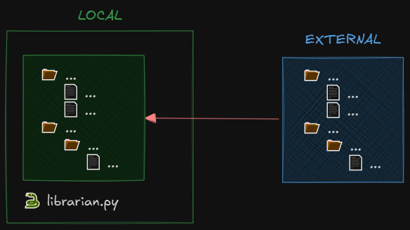

# Readme

The `Librarian` (aka **Library Updater**) is an agent that aims at copying the files from an external folder into a local one: when the first copy is realized, the sync of the two folders is maintained by updating the local folder by following the updates of the external one.

Pseudocode:
- build the index of the **external** folder with the size of each file in a csv format `[filepath] ; [size]`
- build the index of the **local** folder with the size of each file in a csv format `[filepath] ; [size]`
- compare the **local** folder against the **external** one and list all the following cases:
	- missing files, i.e. present in **external** only
	- surplus files, i.e. present in **local** only
	- files modified, i.e. same filepath but different size
- for each of the abovementioned voices execute the following operations
	- copy file to the same filepath
	- delete the file
	- overwrite file to the same filepath, i.e. copy the file

Additional features:
- set a list of exclusions for files in **local** folder that must not be modified, e.g. `librarian.py`
- set a list of files and folder belonging to **external** top be excluded from any operation
- save the index of the files at the end of the procedure (both **local** and **external**), with *relative paths*